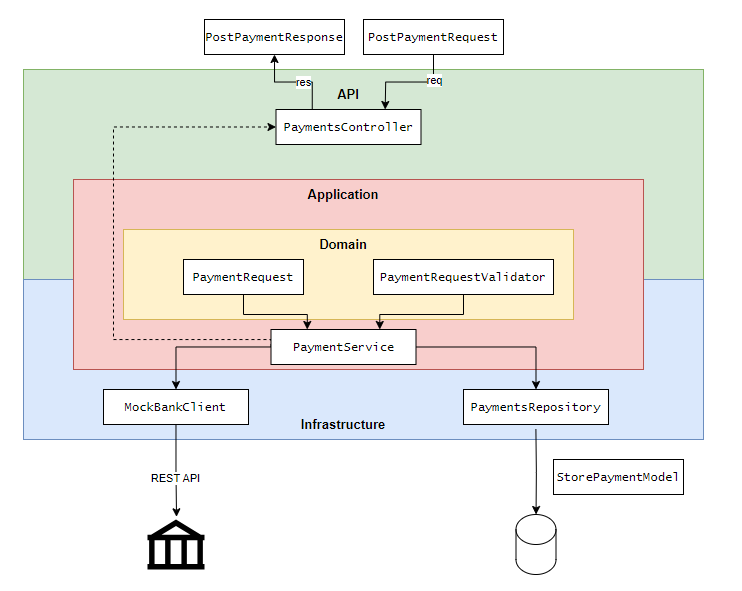
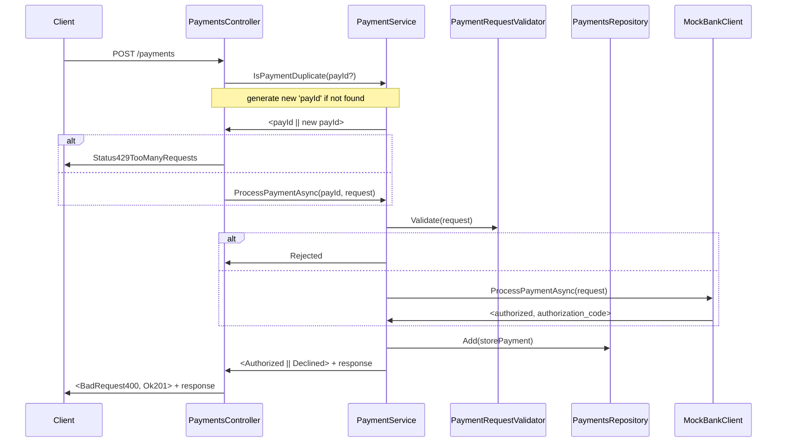

# Instructions for candidates

This is the .NET version of the Payment Gateway challenge. If you haven't already read this [README.md](https://github.com/cko-recruitment/) on the details of this exercise, please do so now. 

## Tests

To run the tests, first, ensure the mock bank Docker image is running. Once the mock bank API is up, all tests can be executed. If Docker is unavailable, you will need to skip the functional tests that rely on the mock bank API.

```bash
docker compose up -d
dotnet test
```

## Architecture

<figure align="center">
  
</figure>

For the architecture of this project, I chose to follow the principles of Hexagonal (or Clean) Architecture. This allows for a clear separation of concerns by dividing the project into three key layers: **Domain**, **Application**, and **Infrastructure**. An additional **API layer** is built on top to expose the functionality.

- **Domain**: This layer encapsulates the core logic of processing a card payment on our platform. It strictly contains the business rules and validation logic, without any external dependencies.
- **Infrastructure**: This layer handles the integration with external systems and includes two key components:
  - **Repository**: Manages the storage and retrieval of payments from the database, which is an out-of-process dependency but manageable.
  - **MockBank Client**: Acts as a wrapper around the external bank's REST API, an unmanaged out-of-process dependency.
- **Application**: This layer orchestrates the interaction between the Domain and Infrastructure, coordinating the process of executing a payment. It acts as the glue, ensuring that domain logic and infrastructure services collaborate seamlessly.

This architecture style supports easy unit testing of the Domain logic, as it remains isolated from external concerns. It also facilitates integration testing of the Application layer services, ensuring that they work correctly with the infrastructure components. Finally, we can perform end-to-end functional testing of the payment process via the REST API, using actual dependencies to validate the entire workflow.

## Payment Request Flow



## Future Improvements

- **Layered Project Structure**: Separate the project into distinct .NET projects (Domain, Application, and Infrastructure) to enforce proper dependency management. This will also allow the introduction of Fitness Function tests to ensure architectural integrity.

- **Model Refactoring**: Refactor all models to prevent the reuse of the same model across different layers, ensuring each layer has its own model representation and abstraction.

- **Expanded Testing Coverage**: Add more comprehensive tests, especially for the infrastructure layer and other missing behaviours in the application, to improve the reliability of the system.

- **Clarification of "OnceOf" Concept**: Reassess the use of the "OneOf" concept, either by refining its purpose or replacing it with a clearer approach.

- **Enhanced Infrastructure Interfaces**: Introduce more interfaces, particularly for the repository, and make these interfaces async to handle asynchronous operations efficiently.

- **Metrics and Distributed Tracing**: Add metrics collection and enhance the system’s activity tracking by capturing distributed traces, improving overall observability. Also, enhance logging for better insights.

- **Retry Policies and Circuit Breaker**: Implement retry policies and a circuit breaker pattern when calling the MockBank to handle potential failures and ensure system resilience.

- **Idempotency for In-Flight Payment Requests**: Address in-flight request idempotency checks to prevent duplicate payment processing.

- **Multi-Bank and Merchant Support**: Expand the project to support interactions with multiple banks and merchants, increasing the flexibility and scalability of the platform.

- **Authentication**: Implement authentication to secure the API and protect access to payment functionalities.

## Time Management

I aimed to make the most of the time available to improve my implementation while maintaining a balanced approach. In total, I spent approximately:

- 3-4 hours on the core implementation,
- 2 hours writing tests,
- 1 hour on documentation.
While I consciously avoided over-engineering, I also wanted to showcase my coding skills. However, time constraints played a critical role in limiting the scope of what I could fully cover in this submission.
